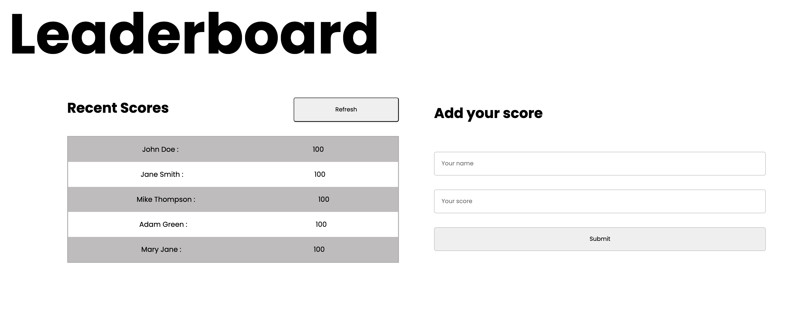

# leaderboard-app

> This is a leaderboard app that displays leader scores and adds them as well.

## Built With

- HTML, CSS and Js (ES6).
- Async, Promises and API consumption
- Webpack
- Git, Github and VsCode.

### Live Demo
 - Click [here]() for the live site.

## Getting Started

To get a local copy up and running follow these simple example steps.

### Prerequisites
- A modern upto-date browser
- Text Editor or IDE

### Setup
 - copy the git link for cloning.

### Install
 - Open terminal
 - run git clone (link)
 - run nmp install
 - run npm build
 - run npm start

### Tests
- run npm test

### Usage
- open index.html file with a server or localhost.

## Authors

👤 **Billions Atugonza joel**

- GitHub: [@billionsjoel](https://github.com/billionsjoel)
- Twitter: [@billionsjoel](https://twitter.com/BillionsJoel)
- LinkedIn: [billionsjoel](https://www.linkedin.com/in/billionsjoel/)

## 🤝 Contributing

Contributions, issues, and feature requests are welcome!

Feel free to check the [issues page](../../issues/).

## Show your support

Give a ⭐️ if you like this project!

## Acknowledgments

- Hat tip to anyone whose code was used
- Inspiration
- etc

## 📝 License

This project is [MIT](./MIT.md) licensed.
